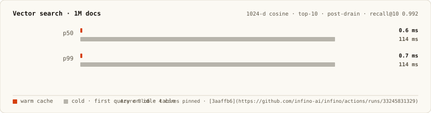
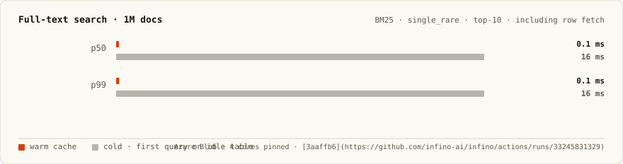
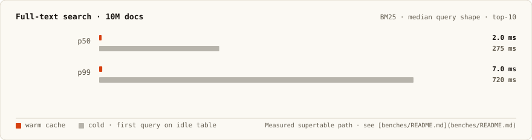
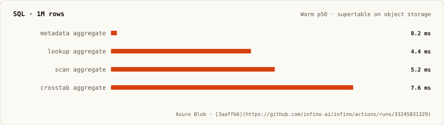
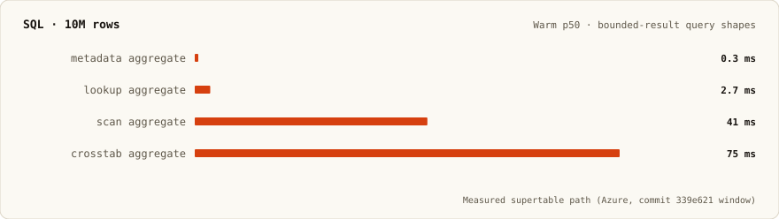

# Infino

[](https://deepwiki.com/infino-ai/infino)
[](https://crates.io/crates/infino)
[](https://docs.rs/infino)
[](https://github.com/infino-ai/infino/actions/workflows/ci.yml)
[](LICENSE)

**SQL, full-text, and vector search on Parquet — one copy on object storage.**

Warm queries on a **1M-document** supertable (Azure CI): **591 µs** vector top-10
(recall@10 **0.992**), **125 µs** BM25 top-10. At the default **10M-document**
scale: **5 ms** vector p50 warm / **314 ms** cold. Full tables:
[benches/README.md](benches/README.md) · [infino.ai](https://infino.ai/).

```sh
pip install infino              # Python
npm install @infino-ai/infino   # Node.js
cargo add infino                # Rust
```

## Performance

All internal charts come from `cargo bench` ([harness guide](benches/README.md)).
Engine behavior is configured in YAML — copy [`src/config/config.yaml`](src/config/config.yaml)
to `./infino.yaml` (or `$XDG_CONFIG_HOME/infino/config.yaml`) and edit the
`vector:` / `supertable:` sections; env vars do not override engine tuning.

Doc count is the only bench env knob: `INFINO_BENCH_SUPERTABLE_DOCS` (plain integer,
no `1M` suffix). Supertable defaults to **10M**; CI pins **1M** for cost.

### Vector search

| Scale | Warm p50 | Cold p50 | Notes |
|------:|---------:|---------:|-------|
| **1M** | **591 µs** | **114 ms** | post-drain · 1024-d · top-10 · [CI run](https://github.com/infino-ai/infino/actions/runs/33245831329) |
| **10M** | **5 ms** | **314 ms** | default supertable scale · top-10 |

<p align="center">
  
</p>

**Reproduce (1M, match CI):**

```sh
cp src/config/config.yaml infino.yaml

INFINO_BENCH_SUPERTABLE_DOCS=1000000 \
INFINO_BENCH_STORE=azure \
INFINO_REAL_AZURE_CONTAINER=$CONTAINER \
AZURE_STORAGE_ACCOUNT_NAME=$ACCOUNT \
AZURE_STORAGE_ACCOUNT_KEY=$KEY \
  cargo bench -- supertable vector warm cold
```

Locally without Azure, omit `INFINO_BENCH_STORE=azure` (RustFS is the default HTTPS
S3 stand-in). Read the **post-drain · default** row in the log.

**Reproduce (10M, default scale):**

```sh
cp src/config/config.yaml infino.yaml
cargo bench -- supertable vector warm cold
```

<p align="center">
  
</p>

### Full-text search

| Scale | Warm p50 | Cold p50 | Query shape |
|------:|---------:|---------:|-------------|
| **1M** | **125 µs** | **16 ms** | BM25 · `single_rare` · top-10 + row fetch · [CI run](https://github.com/infino-ai/infino/actions/runs/33245831329) |
| **10M** | **2 ms** | **275 ms** | BM25 · median query · top-10 |

<p align="center">
  
</p>

**Reproduce (1M):**

```sh
cp src/config/config.yaml infino.yaml

INFINO_BENCH_SUPERTABLE_DOCS=1000000 \
INFINO_BENCH_STORE=azure \
INFINO_REAL_AZURE_CONTAINER=$CONTAINER \
AZURE_STORAGE_ACCOUNT_NAME=$ACCOUNT \
AZURE_STORAGE_ACCOUNT_KEY=$KEY \
  cargo bench -- supertable fts warm cold
```

**Reproduce (10M):**

```sh
cp src/config/config.yaml infino.yaml
cargo bench -- supertable fts warm cold
```

<p align="center">
  
</p>

### SQL

Warm p50 on object storage. At 1M rows (CI); at 10M rows (default supertable scale).

<p align="center">
  
  
</p>

**Reproduce:**

```sh
cp src/config/config.yaml infino.yaml

# 1M (CI scale)
INFINO_BENCH_SUPERTABLE_DOCS=1000000 \
INFINO_BENCH_STORE=azure \
INFINO_REAL_AZURE_CONTAINER=$CONTAINER \
AZURE_STORAGE_ACCOUNT_NAME=$ACCOUNT \
AZURE_STORAGE_ACCOUNT_KEY=$KEY \
  cargo bench -- supertable sql warm

# 10M (default)
cargo bench -- supertable sql warm
```

Query names in the log: `agg_max_title`, `WHERE key = ?`, `AVG(rating) GROUP BY category`,
`COUNT(*) GROUP BY bucket, category`.

### vs vector databases

[VectorDBBench](https://zilliz.com/vdbbench-leaderboard?dataset=vectorSearch) · Cohere 1M ·
768-d · top-100 · serial p99 (lower is faster).

<p align="center">
  
</p>

**Reproduce:** run the Infino client in
[`infino-ai/VectorDBBench`](https://github.com/infino-ai/VectorDBBench/tree/main/vectordb_bench/backend/clients/infino)
against the standard Cohere Medium harness, then compare to the published leaderboard.

### vs search libraries

[Search Benchmark, the Game](https://tantivy-search.github.io/bench/) · latency relative to
Lucene = 1.00 (lower is faster). Infino submission pending on the public board.

<p align="center">
  
</p>

**Reproduce:** build/submit via the
[search-benchmark-game](https://github.com/quickwit-oss/search-benchmark-game) harness.

### vs SQL on Parquet

[ClickBench](https://benchmark.clickhouse.com/#system=+ClickHouse|DuckDB|Infino|DataFusion%20(Parquet,%20single)|Spark|PostgreSQL%20(with%20indexes)&machine=+c6a.4xlarge&cluster_size=-&type=-&metric=hot)
100M rows · vCPU-seconds per query · hot runs · c6a.4xlarge (lower is faster).

<p align="center">
  
</p>

**Reproduce:** [`infino-ai/clickbench`](https://github.com/infino-ai/clickbench/tree/add-infino/infino)
— 43-query suite, 100M rows, Parquet single-file, hot runs on c6a.4xlarge.

---

Regenerate chart SVGs after updating `scripts/readme_charts/bench_data.py`:

```sh
make readme-charts
```

## Quickstart

Index text and vectors on one table, then retrieve — BM25, vector kNN, hybrid, or SQL.

```python
import infino
import pyarrow as pa

db = infino.connect("memory://")   # or "./data", "s3://bucket/prefix"

schema = pa.schema([
    pa.field("body", pa.large_utf8(), nullable=False),
    pa.field("embedding", pa.list_(pa.float32(), 16), nullable=False),
])
docs = db.create_table(
    "docs", schema,
    infino.IndexSpec().fts("body").vector("embedding", 16, "cosine"),
)

billing, appearance = [1.0] + [0.0] * 15, [0.0, 1.0] + [0.0] * 14
docs.append([
    {"body": "To cancel a subscription, open Settings then Billing.", "embedding": billing},
    {"body": "Enable dark mode under Settings then Appearance.",      "embedding": appearance},
])

hits = docs.hybrid_search("body", "cancel subscription", "embedding", billing, 5)
```

Hybrid search composes as SQL — one snapshot, one pass over Parquet:

```sql
SELECT _id, title, score
FROM hybrid_search('logs', 'body', 'disk full', 'embedding', :q, 50)
WHERE level = 'error'
  AND ts > now() - interval '24 hours'
ORDER BY score DESC
LIMIT 10;
```

| Language | Quickstart | Examples |
|----------|------------|----------|
| Python | [infino-python/](infino-python/) | [examples/](infino-python/examples/) |
| Node.js | [infino-node/](infino-node/) | [examples/](infino-node/examples/) |
| Rust | [docs.rs/infino](https://docs.rs/infino) | [examples/](examples/) |

A superfile is valid Parquet — DuckDB, pyarrow, and DataFusion read the columns with no
Infino in the read path. See
[`infino-python/examples/parquet_interop.py`](infino-python/examples/parquet_interop.py).

## Architecture

One Parquet file holds column data plus embedded BM25 and vector indexes. A supertable
manifest composes many superfiles on object storage with snapshot-isolated reads.

- **[Overview →](docs/architecture/overview.md)** — mental model and comparisons
- **[Superfile format →](docs/architecture/superfile.md)** — on-disk layout
- **[Supertable layer →](docs/architecture/supertable.md)** — manifest, commit, query fan-out

Concepts and guides: **[infino.ai/docs](https://infino.ai/docs)**.

## Stability

Public API is pinned by `public-api.txt` (`make public-api`). Crate is 0.x; MSRV **1.95**.
Python and Node version on their own SemVer lines — see [docs/versioning.md](docs/versioning.md).

## Development

```sh
git clone git@github.com:infino-ai/infino.git && cd infino
cargo build
cargo run --example demo
make ci          # before a PR
make readme-charts   # refresh README performance SVGs
```

See [CONTRIBUTING.md](CONTRIBUTING.md). Licensed [Apache-2.0](LICENSE).
