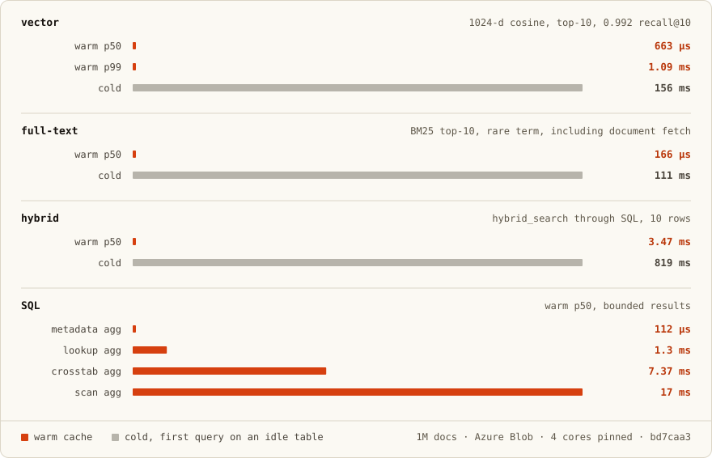

# Infino

[](https://deepwiki.com/infino-ai/infino)
[](https://crates.io/crates/infino)
[](https://docs.rs/infino)
[](https://github.com/infino-ai/infino/actions/workflows/ci.yml)
[](LICENSE)

**SQL, full-text, and vector search, on Parquet.**

Infino is an embedded retrieval engine. It keeps one copy of your data in standard Parquet and serves full-text search, vector search, hybrid search, and SQL directly from it. Infino is focused on delivering millisecond queries across a billion docs at 10x less than traditional engines.


```sh
pip install infino              # Python
npm install @infino-ai/infino   # Node.js
cargo add infino                # Rust
```


## Performance

Infino's in-memory performance and cost savings with Parquet on object storage


1M-document tables on Azure Blob, 4 cores pinned
([CI run](https://github.com/infino-ai/infino/actions/runs/32825375037) on
[`bd7caa3`](https://github.com/infino-ai/infino/commit/bd7caa3b42981a31657c88d1d984dda07a53da9f)).
Warm is steady state. Cold is the first query against an idle table, while the
file handles open and the cache fills.



Warm p99 is 310 µs for the full-text query and 1.09 ms for vector. Infino-only
measurements, reproducible with `cargo bench`. Methodology and full tables:
[`benches/README.md`](benches/README.md).

## Hybrid search is SQL

`bm25_search`, `vector_search`, `hybrid_search`, `token_match`, and
`exact_match` are SQL table-valued functions, so a ranked result set is an
ordinary relation. Retrieval, filters, joins, aggregation, and windows
compose in one statement against one pinned snapshot — no client-side
stitching between a search engine and a database.

```sql
-- one query: hybrid search + SQL filters, one pass over Parquet
SELECT   _id, title, score
FROM     hybrid_search(                    -- BM25 + vector, fused by RRF
           'logs', 'body', 'disk full',
           'embedding', :q, 50
         )
WHERE    level = 'error'                   -- pushed-down filter
  AND    ts > now() - interval '24 hours'  -- on the same pass
ORDER BY score DESC
LIMIT    10;
```

Because the result is a relation, the follow-up question is still SQL. Join a
plain table, group by team, average the score — no export, no second engine,
no Python between retrieval and the answer:

```sql
SELECT   s.team,
         count(*)     AS hits,
         avg(h.score) AS relevance
FROM     hybrid_search('logs', 'body', 'disk full', 'embedding', :q, 1000) AS h
JOIN     services s ON s.id = h.service_id
WHERE    h.ts > now() - interval '7 days'
GROUP BY s.team
ORDER BY hits DESC;
```


## Quickstart

Index a text column and a vector column on one table, then retrieve from it.
The 16-dimensional vectors below stand in for your embedding model so the
snippet runs as-is.

```python
import infino
import pyarrow as pa

db = infino.connect("memory://")   # or "./data", or "s3://bucket/prefix"

schema = pa.schema([
    pa.field("body", pa.large_utf8(), nullable=False),
    pa.field("embedding", pa.list_(pa.float32(), 16), nullable=False),
])
docs = db.create_table(
    "docs", schema,
    infino.IndexSpec().fts("body").vector("embedding", 16, "cosine"),
)

billing, appearance = [1.0] + [0.0] * 15, [0.0, 1.0] + [0.0] * 14
docs.append([                      # one append is one atomic commit
    {"body": "To cancel a subscription, open Settings then Billing.", "embedding": billing},
    {"body": "Enable dark mode under Settings then Appearance.",      "embedding": appearance},
])

hits = docs.hybrid_search("body", "cancel subscription", "embedding", billing, 5)
```

The same retrievers exist in every binding, and as the SQL table-valued
functions shown above.


| Language | Quickstart                               | Examples                                                                  |
| -------- | ---------------------------------------- | ------------------------------------------------------------------------- |
| Python   | [infino-python/](infino-python/)         | [RAG, code search, analytics, LangChain, CrewAI](infino-python/examples/) |
| Node.js  | [infino-node/](infino-node/)             | [hybrid-search service, agent memory](infino-node/examples/)              |
| Rust     | [docs.rs/infino](https://docs.rs/infino) | [examples/](examples/)                                                    |


Infino installs the [mimalloc](https://github.com/microsoft/mimalloc) global
allocator by default; if your process already sets one, use
`infino = { version = "0.5", default-features = false }`.

## Fits the stack you already have

A superfile *is* a spec-compliant Parquet file. The index regions are spliced
in ahead of a standard footer and pointed at by `inf.*` key/value metadata,
which conformant readers ignore. DuckDB, pandas, pyarrow, DataFusion,
Snowflake, and Databricks read the columnar body directly:

```python
import duckdb   # no infino in this line; the table above, persisted to ./data
duckdb.sql("SELECT body FROM read_parquet('data/**/*.sf.parquet')").show()
# ┌──────────────────────────────────────────────────────┐
# │                         body                         │
# ├──────────────────────────────────────────────────────┤
# │ To cancel a subscription, open Settings then Billing.│
# │ Enable dark mode under Settings then Appearance.     │
# └──────────────────────────────────────────────────────┘
```

The compatibility is one-directional: standard tools *read* a superfile, but
rewriting one through a generic Parquet writer silently drops the embedded
indexes. Full walkthrough — write a corpus, search it, read the same file back
with DuckDB and pyarrow — in
[infino-python/examples/parquet_interop.py](infino-python/examples/parquet_interop.py).

## Spec


|          |                                                    |
| -------- | -------------------------------------------------- |
| search   | full-text · vector · hybrid                        |
| index    | BM25 (PFOR-delta, FST) · HNSW · OPANN + Sq16       |
| engine   | Rust                                               |
| language | SQL (Apache DataFusion)                            |
| storage  | object storage: S3 · GCS · Azure Blob · local disk |
| format   | Apache Parquet                                     |
| license  | Apache-2.0                                         |


## Cloud storage

The backend comes from the URI scheme — `s3://`, `az://`, `gs://`, `file://`,
a bare path, or `memory://`. Credentials go through `ConnectOptions`, keyed by
`object_store`'s config strings (`aws_*` / `azure_*` / `google_*`). Infino
reads no credentials from the environment; omit them to use ambient cloud
identity (IAM instance role, managed identity, workload-identity ADC).

```rust
use infino::{connect_with, ConnectOptions};

let db = connect_with("s3://bucket/prefix", ConnectOptions::new()
    .with_storage_option("aws_access_key_id", "…")
    .with_storage_option("aws_secret_access_key", "…")
    .with_storage_option("aws_region", "us-east-1"))?;
# Ok::<(), Box<dyn std::error::Error>>(())
```

Unknown or cross-backend keys are rejected at connect. `with_validate(true)`
adds a reachability probe so bad credentials fail at `connect` rather than on
the first query. The same options exist in the config file
(`storage.storage_options`) and both bindings.

## Architecture

- **[Overview →](docs/architecture/overview.md)** — what Infino is, the mental
model, how it compares to other systems.
- **[Superfile format →](docs/architecture/superfile.md)** — the single-file
layout, Parquet compatibility, full-text and vector index design.
- **[Supertable layer →](docs/architecture/supertable.md)** — manifest
snapshots, commit/publish path, query fan-out with manifest-only pruning,
reader/writer concurrency.

Concepts, guides, and examples: **[infino.ai/docs](https://infino.ai/docs)**.

## Stability

The public API is what the crate root re-exports, pinned by a
`cargo-public-api` snapshot (`public-api.txt`); any change to it is reviewed as
a contract change in the same pull request. The crate is 0.x — breaks are
possible, but each one shows in the snapshot diff and the release notes.
Arrow and DataFusion types are part of the contract, growable public types are
`#[non_exhaustive]`, and the MSRV is **1.95**. The Python and Node packages
version on their own SemVer lines; see
[docs/versioning.md](docs/versioning.md).

## Development

```sh
git clone git@github.com:infino-ai/infino.git
cd infino
cargo build
cargo run --example demo        # build, search, read back as Parquet
cargo test --workspace          # full suite
make ci                         # what CI runs; do this before a PR
```

`rust-toolchain.toml` pins the toolchain, so `rustup` installs the right
stable on first build. `make doc` browses the API locally, `pre-commit install`
catches formatting and lints before a commit, and the full-text surface runs
clean under [miri](https://github.com/rust-lang/miri) and
[AddressSanitizer](https://clang.llvm.org/docs/AddressSanitizer.html)
(`make miri`, `make asan`).

See [CONTRIBUTING.md](CONTRIBUTING.md) for the full guide. Licensed
[Apache-2.0](LICENSE).