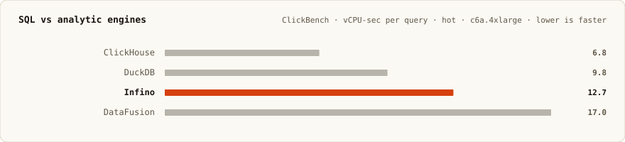

# Infino

[](https://deepwiki.com/infino-ai/infino)
[](https://crates.io/crates/infino)
[](https://docs.rs/infino)
[](https://github.com/infino-ai/infino/actions/workflows/ci.yml)
[](LICENSE)

**SQL, full-text, and vector search over one copy of your data on object storage.**

Infino is an embedded retrieval engine. A "superfile" is a valid Apache Parquet file with
BM25 and vector indexes spliced into it, so one copy serves all three query types — no
daemon, no separate search cluster, no second copy to keep in sync.


```sh
pip install infino              # Python
npm install @infino-ai/infino   # Node.js
cargo add infino                # Rust
```

## Performance

Warm p50, supertable on object storage:

| | 1M docs | 10M docs |
|---|---|---|
| **Vector** top-10, recall@10 0.992 | **591 µs** | **5 ms** |
| **BM25** top-10, incl. row fetch | **125 µs** | **2 ms** |
| **SQL** point lookup → crosstab | **186 µs – 7.6 ms** | **260 µs – 75 ms** |

Cold — the first query against an idle table, while handles open and the cache fills — is
114 ms / 314 ms for vector and 16 ms / 275 ms for BM25. Charts are log-scale, since warm
and cold are ~200× apart.

The two scales come from **separate measurement windows** and are not directly comparable
to each other: 1M is Azure CI ([run 33245831329](https://github.com/infino-ai/infino/actions/runs/33245831329),
4 cores pinned), 10M is the default supertable scale measured on its own run.


<details>
<summary><b>Reproduce these numbers</b> — config and exact commands</summary>

Engine behavior is configured in YAML only; environment variables never override it. Start
from the shipped defaults, which are what the charts above measure:

```sh
cp src/config/config.yaml infino.yaml    # or $XDG_CONFIG_HOME/infino/config.yaml
```

Edit the `vector:` block to change probe depth, rerank codec, or cell counts; `supertable:`
for commit and cache behavior. Leave both alone to reproduce the charts as published.

Corpus size is the one bench knob that *is* an environment variable, and it takes a plain
integer (`1000000`, not `1M`). Supertable defaults to 10M:

| Chart | Command |
|---|---|
| Vector, 10M | `cargo bench -- supertable vector warm cold` |
| BM25, 10M | `cargo bench -- supertable fts warm cold` |
| SQL, 10M | `cargo bench -- supertable sql warm` |
| Any chart, 1M | prefix with `INFINO_BENCH_SUPERTABLE_DOCS=1000000` |

That runs against a local RustFS daemon (an HTTPS S3 stand-in) by default. To match CI
exactly, add the Azure backend:

```sh
INFINO_BENCH_SUPERTABLE_DOCS=1000000 \
INFINO_BENCH_STORE=azure \
INFINO_REAL_AZURE_CONTAINER=$CONTAINER \
AZURE_STORAGE_ACCOUNT_NAME=$ACCOUNT \
AZURE_STORAGE_ACCOUNT_KEY=$KEY \
  cargo bench -- supertable vector warm cold
```

Reading the output: vector numbers are the **post-drain `default`** row; BM25 is
`single_rare` under **Supertable FTS — queries + cost**; SQL query names are
`agg_max_title` (metadata), `WHERE key = ?` (lookup), `AVG(rating) GROUP BY category`
(scan), and `COUNT(*) GROUP BY bucket, category` (crosstab). Structured results land in
`target/infino-bench/*.json`. Full methodology: [benches/README.md](benches/README.md).

</details>

### How Infino compares

Infino is a retrieval engine that also runs analytics, so it is measured against
specialists in each category on their own published harnesses.




Read honestly: Infino leads on vector, trades with Lucene on full-text (19% slower on
search, 26% faster on count), and lands mid-pack on ClickBench behind ClickHouse and
DuckDB. The point is that one engine covers all three from a single Parquet copy while
staying within range of each specialist.

Harnesses: [VectorDBBench](https://zilliz.com/vdbbench-leaderboard?dataset=vectorSearch)
(client in [infino-ai/VectorDBBench](https://github.com/infino-ai/VectorDBBench/tree/main/vectordb_bench/backend/clients/infino)) ·
[Search Benchmark, the Game](https://tantivy-search.github.io/bench/)
([harness](https://github.com/quickwit-oss/search-benchmark-game); Infino rows pending on the public board) ·
[ClickBench](https://benchmark.clickhouse.com/#system=+ClickHouse%7CDuckDB%7CInfino%7CDataFusion%20%28Parquet%2C%20single%29%7CSpark%7CPostgreSQL%20%28with%20indexes%29&machine=+c6a.4xlarge&cluster_size=-&type=-&metric=hot)
([port](https://github.com/infino-ai/clickbench/tree/add-infino/infino)).

## Adaptive vector indexing

Infino serves vector search from one of two index paths, selected by
`vector.search_mode` in YAML. Both search quantized codes — `ivf` scores 1-bit RaBitQ and
then re-ranks, `hnsw_ivf` walks an int8 plane and refines on Sq16 — so neither is an exact
full scan. `IndexSpec::vector(column, dim, metric)` takes no index-type argument, which
makes the path a runtime setting rather than something frozen at table creation.

| `search_mode` | Path | When to use |
|---|---|---|
| `ivf` *(default)* | Grid-route to cells, then scan each cell at the per-cell width stamped in the manifest. Reads come off NVMe cache and reclaim under memory pressure. | Any scale. The only path for filtered queries, and the automatic fallback everywhere else. |
| `hnsw_ivf` | Walk a resident in-memory HNSW graph over every row's Sq16 codes, skipping the grid, cell selection, and disk reads entirely. | Single-box, latency-tier tables that fit RAM (≤ `hnsw_max_docs`, default 10M rows). |

The `_ivf` suffix is the contract: `hnsw_ivf` means "graph if one exists, otherwise IVF."
A missing graph — pre-drain, above the row ceiling, a different column, or a corpus the
calibrator rejected — silently serves `ivf`. Correctness never depends on the graph.

```yaml
# infino.yaml
vector:
  # Declare the recall you want; the drain calibrates the index to hit it.
  target_recall: 0.99      # default

  search_mode: hnsw_ivf    # default: ivf
  hnsw_max_docs: 10000000  # above this, the graph is not built at all
  hnsw_recall_slack: 0.01  # accept the graph down to target_recall - slack
  hnsw_m0: 0               # 0 = calibrator picks base-layer degree
  hnsw_ef_construction: 200
  hnsw_ef_ceil: 2048       # ceiling on the calibration ef sweep

  # Within search_mode: ivf, choose the cluster router.
  ivf_router: stamped      # or: centroid_graph (experimental, cold-read win at 10M+)
```

### What `optimize()` actually does

`optimize()` is the maintenance entry point, and it runs three phases in order:

1. **Drain the hidden vector cells.** Vector search runs over a hidden, cell-ordered index
   supertable dual-written alongside your time-ordered table. The drain merges pending
   per-cell delta superfiles, refreshes centroids and radii, splits overflow cells, and —
   under `hnsw_ivf` — builds and calibrates the resident graph. New superfiles are written
   to object storage; nothing is edited in place.
2. **Compact, then re-measure the probe laws.** Merge small or underfilled superfiles
   toward `compaction.target_superfile_size_mb`, cutting query fan-out. Merging and cell
   splitting change the geometry the per-cell probe width and fine depth were measured
   against, so when the pass reshapes the index those laws are re-measured and re-stamped
   into the manifest. Recalibration is monotonic on fine depth — it never shallows a depth
   an earlier measurement certified.
3. **Sweep.** Best-effort garbage collection of orphaned superfiles, manifests, dead
   tombstone sidecars, and completed WAL state.

Recalibration also fires without a reshape, when a stamped width has outgrown the rerank
pool that measured it. That case can't self-heal on a table that never splits or merges, so
without the check a bulk-load-then-optimize flow would leave the default path on a constant
probe budget indefinitely.

```python
table.optimize()                    # engine defaults
```

```rust
table.optimize(&OptimizeOptions::default())?;
```

Both require durable storage. `vector.maintenance_threads` (default `auto`, meaning every
hardware thread, on the assumption that an explicit optimize owns its machine) caps the CPU
pool for the maintenance compute — cell-split k-means, child builds, and probe-law
recalibration. Lower it when optimize runs alongside latency-critical foreground work. The
ingest commit path does not ride this pool.

### What adapts on its own

Every decision below is re-derived on each drain, so a table is never permanently locked
into a choice made when it was small:

| Decision | Governed by | Default |
|---|---|---|
| Is this corpus graph-friendly at all? A cheap probe on a subsample; a probe that can't register is a hard "skip the expensive build, serve `ivf`" signal. | `hnsw_probe_max_docs` | `100000` |
| Does the graph fit? Above the ceiling only the much smaller centroid graph is built and queries take the scan path. | `hnsw_max_docs` | `10000000` |
| How dense must the base layer be? Swept until recall reaches the target — high-dimensional vectors need a denser layer-0. | `hnsw_m0` (`0` = auto) | `0` |
| What query-time beam? The drain sweeps `ef` candidates and stamps the per-table winner into the persisted bundle. | `hnsw_ef_ceil` | `2048` |
| Keep the graph or fall back? If calibrated recall lands below `target_recall - slack`, the drain gives up and serves `ivf`. | `hnsw_recall_slack` | `0.01` |
| When does a cell split? On a hard row cap, or when a cell goes genuinely multi-modal (Ashman's D on the axis between a two-means partition). | `cell_split_doc_cap`, `cell_split_modality_d` | `500000`, `8.0` |
| How wide and how deep does a query probe each cell? Measured per table and stamped in the manifest, then re-measured whenever compaction or a split changes the geometry. | `target_recall`, `fine_nprobe_floor`, `fine_nprobe_pct` | `0.99`, `4`, `0.0` |

Memory follows from these: the resident graph is bounded by rows × `m0` on the base layer,
capped by `hnsw_max_docs`. `hnsw_sq8_walk` (default `true`) navigates on an int8 plane
derived from the Sq16 codes and re-ranks the final `hnsw_refine_k` (default `256`)
candidates on full Sq16 — roughly half the warm latency at unchanged recall, for about one
extra byte per dimension per row. Set it to `false` to walk on Sq16 only and drop that plane.

## Hybrid search is SQL

`bm25_search`, `vector_search`, `hybrid_search`, `token_match`, and `exact_match` are SQL
table-valued functions, so a ranked result set is an ordinary relation. Retrieval, filters,
joins, and aggregation compose in one statement against one pinned snapshot — no
client-side stitching between a search engine and a database.

```sql
SELECT _id, title, score
FROM hybrid_search('logs', 'body', 'disk full', 'embedding', :q, 50)
WHERE level = 'error'
  AND ts > now() - interval '24 hours'
ORDER BY score DESC
LIMIT 10;
```

## Quickstart

```python
import infino
import pyarrow as pa

db = infino.connect("memory://")   # or "./data", "s3://bucket/prefix"

schema = pa.schema([
    pa.field("body", pa.large_utf8(), nullable=False),
    pa.field("embedding", pa.list_(pa.float32(), 16), nullable=False),
])
docs = db.create_table(
    "docs", schema,
    infino.IndexSpec().fts("body").vector("embedding", 16, "cosine"),
)

billing, appearance = [1.0] + [0.0] * 15, [0.0, 1.0] + [0.0] * 14
docs.append([
    {"body": "To cancel a subscription, open Settings then Billing.", "embedding": billing},
    {"body": "Enable dark mode under Settings then Appearance.",      "embedding": appearance},
])

hits = docs.hybrid_search("body", "cancel subscription", "embedding", billing, 5)
```

| Language | Quickstart | Examples |
|----------|------------|----------|
| Python | [infino-python/](infino-python/) | [examples/](infino-python/examples/) |
| Node.js | [infino-node/](infino-node/) | [examples/](infino-node/examples/) |
| Rust | [docs.rs/infino](https://docs.rs/infino) | [examples/](examples/) |

Because a superfile is valid Parquet, DuckDB, pyarrow, and DataFusion read the columns with
no Infino in the read path — see
[`parquet_interop.py`](infino-python/examples/parquet_interop.py).

## Architecture

A supertable manifest composes many immutable superfiles on object storage, giving
snapshot-isolated reads, append-only writes, and atomic commits.

- **[Overview →](docs/architecture/overview.md)** — mental model and comparisons
- **[Superfile format →](docs/architecture/superfile.md)** — on-disk layout
- **[Supertable layer →](docs/architecture/supertable.md)** — manifest, commit, query fan-out

Concepts and guides: **[infino.ai/docs](https://infino.ai/docs)**.

## Development

```sh
git clone git@github.com:infino-ai/infino.git && cd infino
cargo build
cargo run --example demo
make ci                # gates before a PR
make readme-charts     # regenerate the charts above
```

The public API is pinned by `public-api.txt` (`make public-api`). The crate is 0.x; MSRV
**1.95**. Python and Node version on their own SemVer lines — see
[docs/versioning.md](docs/versioning.md).

See [CONTRIBUTING.md](CONTRIBUTING.md). Licensed [Apache-2.0](LICENSE).
