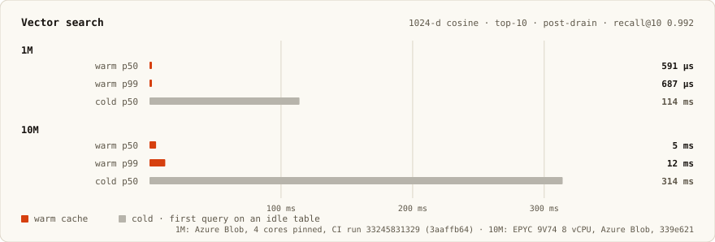
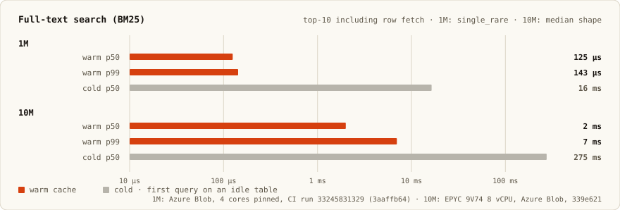
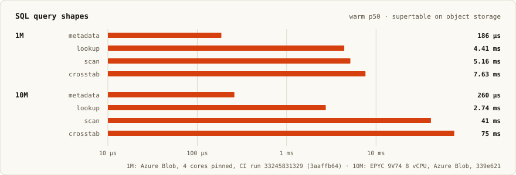
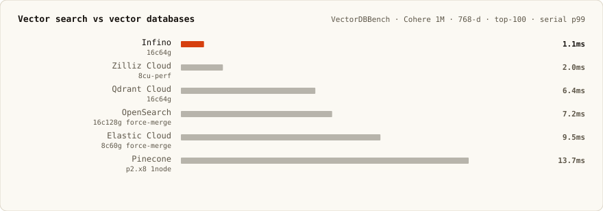
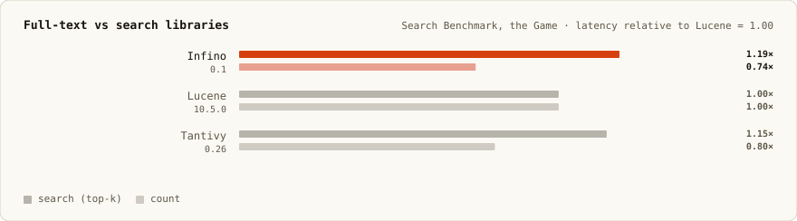
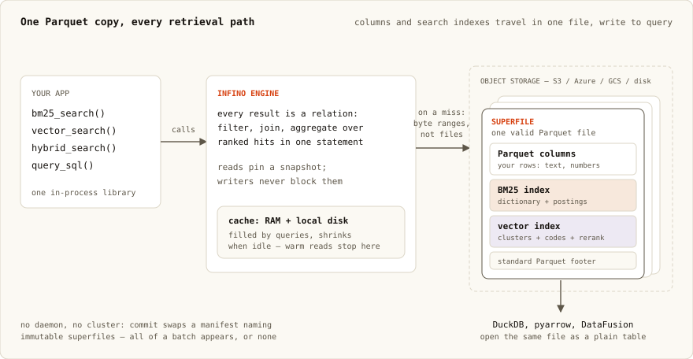

# Infino

[](https://deepwiki.com/infino-ai/infino)
[](https://crates.io/crates/infino)
[](https://docs.rs/infino)
[](https://github.com/infino-ai/infino/actions/workflows/ci.yml)
[](LICENSE)

# Fast hybrid search, embedded.

Infino is a retrieval library you link into your process. Full-text, vector, hybrid, and
SQL over the same table, with **125 µs** BM25 and **591 µs** vector top-10 warm.

It starts in memory on your laptop. When the data outgrows RAM, you change the connection
string and nothing else — the tables are Parquet on object storage, and the engine reads
them in place.

```python
db = infino.connect("memory://")            # laptop
db = infino.connect("./data")               # on-prem disk
db = infino.connect("s3://bucket/prefix")   # past RAM, same app code
```

Built by the team that created OpenSearch.

```sh
pip install infino              # Python
npm install @infino-ai/infino   # Node.js
cargo add infino                # Rust
```

## Quickstart

```python
import infino
import pyarrow as pa

db = infino.connect("memory://")

schema = pa.schema([
    pa.field("body", pa.large_utf8(), nullable=False),
    pa.field("embedding", pa.list_(pa.float32(), 384), nullable=False),
])
docs = db.create_table(
    "docs", schema,
    infino.IndexSpec().fts("body").vector("embedding", 384, "cosine"),
)

docs.append(rows)   # list of dicts, or an Arrow RecordBatch

# One call, both signals, fused ranking. `query_vec` is your embedding.
hits = docs.hybrid_search("body", "disk full", "embedding", query_vec, k=10)
```

## Performance

Warm p50, tables on object storage:

| | 1M docs | 10M docs |
|---|---|---|
| **Vector** top-10, recall@10 0.992 | **591 µs** | **5 ms** |
| **BM25** top-10, incl. row fetch | **125 µs** | **2 ms** |
| **SQL** point lookup → crosstab | **186 µs – 7.6 ms** | **260 µs – 75 ms** |

Cold, meaning the first query on an idle table while handles open and the cache fills, is
114 ms and 314 ms for vector, 16 ms and 275 ms for BM25. The charts are log-scale because
warm and cold sit about 200× apart.







Measured on Azure Blob with 4 cores pinned ([CI run 33245831329](https://github.com/infino-ai/infino/actions/runs/33245831329))
for 1M, and on a separate run at the default 10M scale. The two scales come from different
commits and different hardware, so read each against its own baseline rather than against
the other.

<details>
<summary><b>Reproduce every chart</b> — config and exact commands</summary>

Engine behavior is configured in YAML only; environment variables never override it. Start
from the shipped defaults, which are exactly what the charts measure:

```sh
cp src/config/config.yaml infino.yaml    # or $XDG_CONFIG_HOME/infino/config.yaml
```

The `vector:` block holds probe depth, rerank codec, and cell counts. The `supertable:`
block holds commit and cache behavior. Leave both alone to reproduce the published charts.

Corpus size is the one bench knob that is an environment variable, and it takes a plain
integer (`1000000`, not `1M`). The table tier defaults to 10M:

| Chart | Command |
|---|---|
| Vector, 10M | `cargo bench -- supertable vector warm cold` |
| BM25, 10M | `cargo bench -- supertable fts warm cold` |
| SQL, 10M | `cargo bench -- supertable sql warm` |
| Any chart, 1M | prefix with `INFINO_BENCH_SUPERTABLE_DOCS=1000000` |

That runs against a local RustFS daemon, an HTTPS S3 stand-in, by default. To match CI:

```sh
INFINO_BENCH_SUPERTABLE_DOCS=1000000 \
INFINO_BENCH_STORE=azure \
INFINO_REAL_AZURE_CONTAINER=$CONTAINER \
AZURE_STORAGE_ACCOUNT_NAME=$ACCOUNT \
AZURE_STORAGE_ACCOUNT_KEY=$KEY \
  cargo bench -- supertable vector warm cold
```

Reading the output: vector is the post-drain `default` row; BM25 is `single_rare` under
**Supertable FTS — queries + cost**; the SQL shapes are `agg_max_title` (metadata),
`WHERE key = ?` (lookup), `AVG(rating) GROUP BY category` (scan), and
`COUNT(*) GROUP BY bucket, category` (crosstab). Structured results land in
`target/infino-bench/*.json`. Methodology: [benches/README.md](benches/README.md).

</details>

On the public retrieval benchmarks, Infino has the lowest p99 on
[VectorDBBench](https://zilliz.com/vdbbench-leaderboard?dataset=vectorSearch)
([client](https://github.com/infino-ai/VectorDBBench/tree/main/vectordb_bench/backend/clients/infino)),
and on [Search Benchmark, the Game](https://tantivy-search.github.io/bench/) it is 19%
slower than Lucene on search and 26% faster on count.





The SQL engine is DataFusion and exists to make retrieval composable, not to compete with
an analytics warehouse. For reference, Infino's
[ClickBench](https://benchmark.clickhouse.com/#system=+ClickHouse%7CDuckDB%7CInfino%7CDataFusion%20%28Parquet%2C%20single%29%7CSpark%7CPostgreSQL%20%28with%20indexes%29&machine=+c6a.4xlarge&cluster_size=-&type=-&metric=hot)
run sits behind ClickHouse and DuckDB and ahead of DataFusion
([port](https://github.com/infino-ai/clickbench/tree/add-infino/infino)).

## Why it's fast

Object storage is 20–100 ms away, which is the obvious objection to running search on it.



The index is byte-addressable. Infino writes a superfile: a valid Parquet file with BM25 and
vector indexes spliced in. Posting lists and IVF cells are laid out so top-k resolves to a
bounded set of byte ranges rather than the whole file. Cold, those are exact range GETs, and
when the manifest carries the open batch, opening the superfile costs no GETs at all. There
is no "load the index" step, because the index is read in place.

Warm queries never leave the machine. Fetched ranges land in a disk-backed cache and are
memory-mapped, so a repeat query is page-cache reads and SIMD scoring. That is where 591 µs
comes from. The cache is reclaimable: it shrinks under memory pressure, down to zero on an
idle table, and refills on the next query.

Commits are a pointer swap. A manifest lists immutable superfiles; writers append new files
and swap the manifest atomically while readers hold a pinned snapshot. There is no
coordinator and no leader election, which is what lets this be a library instead of a
service.

Because the file is ordinary Parquet, DuckDB, pyarrow, and DataFusion read the columns with
Infino nowhere in the read path — see
[`parquet_interop.py`](infino-python/examples/parquet_interop.py).

## Retrieval is a relation

`bm25_search`, `vector_search`, `hybrid_search`, `token_match`, and `exact_match` are SQL
table-valued functions, so a ranked result set is an ordinary table. Retrieval, filters,
joins, and aggregation compose in one statement against one pinned snapshot. One query
replaces several, which matters when an agent pays a round trip per call.

```sql
-- a ranked search is a relation: join it, group it, aggregate it
SELECT   s.team,
         count(*)      AS hits,
         avg(h.score)  AS relevance
FROM     hybrid_search('logs', 'body', 'disk full', 'embedding', :q, 1000) AS h
JOIN     services s ON s.id = h.service_id
WHERE    h.ts > now() - interval '7 days'
GROUP BY s.team
ORDER BY hits DESC;
```

## Indexes calibrate themselves

You declare a recall target and the engine decides how to reach it. On `optimize()`, Infino
measures the corpus and picks the vector path: an IVF cell scan over 1-bit RaBitQ codes, or
a resident HNSW graph when the table fits RAM and the distribution suits a graph. A
calibrated graph that cannot reach the target is discarded and the scan path serves instead.
Per-cell probe width and depth are re-measured whenever compaction or a cell split changes
the geometry they were fitted against.

```yaml
# infino.yaml
vector:
  target_recall: 0.99      # declare the goal
  search_mode: hnsw_ivf    # default: ivf. hnsw_ivf falls back to ivf automatically
```

```python
table.optimize()    # drain, compact, recalibrate, sweep
```

Every knob, with the measurement behind each default, is documented inline in
[`src/config/config.yaml`](src/config/config.yaml).

## When not to use Infino

- **You need per-row durability.** Commit is the durability boundary. Rows are durable when
  a commit lands, not when `append()` returns.
- **You need OLTP.** Tables are append-only and time-ordered; updates are delete plus insert
  via tombstones. There are no transactions across tables.
- **You need many concurrent writers on one table.** Writes go through a single writer slot.
  Readers are unbounded and never blocked.
- **You want a server.** This crate is embedded, with a SQL and Arrow surface. REST, the
  Elasticsearch-compatible query DSL, and the hosted control plane are not in this
  repository.

The crate is 0.x and the API can still move. The public surface is pinned by
`public-api.txt`.

## Documentation

- **[Overview →](docs/architecture/overview.md)** — the mental model, and how this compares
- **[Superfile format →](docs/architecture/superfile.md)** — how indexes fit inside Parquet
- **[Supertable layer →](docs/architecture/supertable.md)** — manifest, commit, query fan-out
- **[infino.ai/docs](https://infino.ai/docs)** — concepts and guides

| Language | Package | Examples |
|----------|---------|----------|
| Python | [infino-python/](infino-python/) | [examples/](infino-python/examples/) |
| Node.js | [infino-node/](infino-node/) | [examples/](infino-node/examples/) |
| Rust | [docs.rs/infino](https://docs.rs/infino) | [examples/](examples/) |

## Development

```sh
git clone git@github.com:infino-ai/infino.git && cd infino
cargo build
cargo run --example demo
make ci                # gates before a PR
make readme-charts     # regenerate the charts above
```

MSRV **1.95**. Python and Node version on their own SemVer lines
([docs/versioning.md](docs/versioning.md)). See [CONTRIBUTING.md](CONTRIBUTING.md).
Licensed [Apache-2.0](LICENSE).
